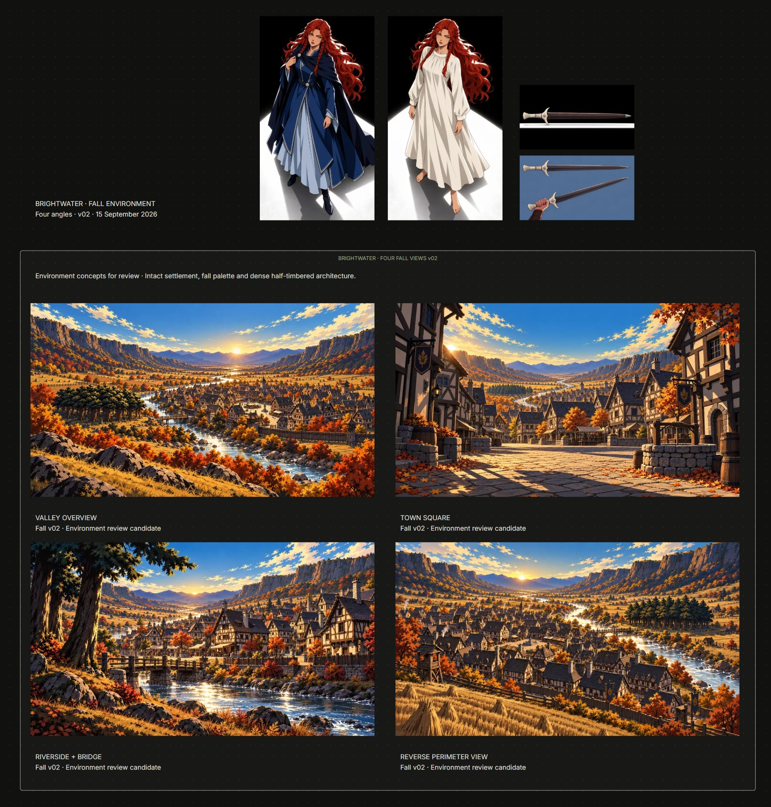
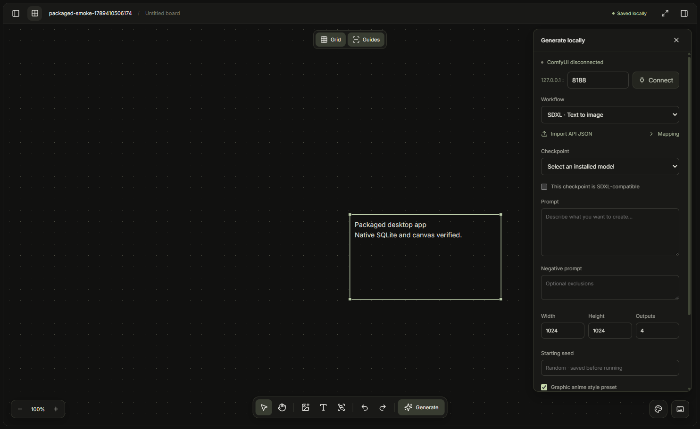
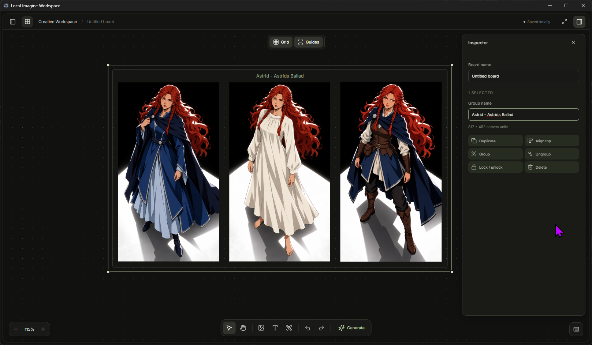
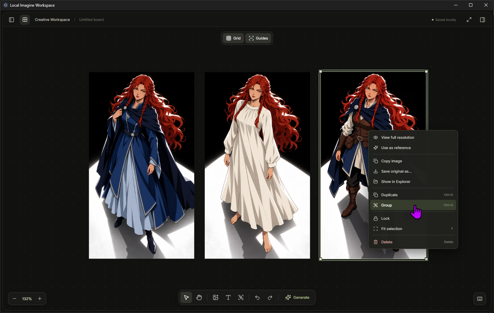

# Local Imagine Workspace

Source repository: **GenBoard Workspace**. The Windows application is currently named **Local Imagine Workspace**.

See the [changelog](CHANGELOG.md) for release changes.

A standalone Windows desktop canvas for local images, notes, reference groups, and ComfyUI generation. Projects and ComfyUI image inference stay on your computer. The optional Codex agent uses an online Codex account; manual canvas operation remains offline. There is no application telemetry, remote font, or runtime CDN dependency.

## Run or install

[Download the Windows x64 installer](https://github.com/Wrathalan/GenBoard-Workspace/releases/latest). Download the `.exe` asset, run it, and choose an installation folder. Releases include a SHA-256 checksum file for download verification. The installer is unsigned, so Windows may display an unrecognized-app warning.

Building locally writes the installer to `release/Local Imagine Workspace Setup 0.3.6.exe`. The unpacked application is `release/win-unpacked/Local Imagine Workspace.exe`.

For development, install Node.js 24 LTS and run:

```powershell
npm ci
npm run dev
```

`npm run dev` builds and opens the Electron application. It does not start a web server or download inference models. Dependency installation and packaging may require internet access; ordinary app operation does not.

```powershell
npm test
npm run test:desktop
npm run package
```

The lockfile pins dependencies. Native SQLite is rebuilt for Electron during `npm ci`. If you change Electron versions, run `npm run postinstall` before testing or packaging. Packaging produces an unsigned, per-user NSIS installer; no administrator installation is required.

## Screenshots and example workflows

These screenshots show example artwork, workspace arrangements, and a synthetic test workspace. Some show earlier interface labels; they illustrate workflows rather than prove that a generation job ran in this release. The artwork and example project are not bundled with the installer.

### Plan a complete creative board



This board overview brings character designs, props, and environment studies into one visual reference sheet. A labeled group collects four views of the same autumn settlement: valley overview, town square, riverside bridge, and reverse perimeter. Image cards, notes, and group frames let you organize a project by subject and compare visual continuity across shots. This overview is supplied as a board example, without the application's surrounding controls.

### Prepare local image generation



The project drawer holds boards and the image library; the central canvas provides space for references. The generation panel exposes the local ComfyUI connection, workflow, checkpoint, prompt, dimensions, output count, seed, and editable style preset. This screenshot uses synthetic test content and demonstrates setup controls, not completed local inference. Start your existing ComfyUI installation and connect before generating.

### Keep related references together



Three costume variants are arranged inside a named group. The Inspector provides group naming, duplication, alignment, grouping, locking, and deletion; Grid and Guides controls help keep the layout orderly. In this release, dragging any member moves the whole outermost group while preserving spacing. Ungroup first to reposition or resize individual members.

### Work directly from an image



Right-click an image for full-resolution viewing, reference assignment, clipboard copy, original-file export, and Explorer access. The same menu offers duplication, grouping, locking, fitting the selection, and deletion. These actions keep common reference-board tasks close to the artwork. Current versions also include sensitive-item and item-color controls described below.

## Open in a browser

Run `npm run browser` from this folder, then open [Local Imagine Workspace](http://127.0.0.1:4317/) in the Codex browser or another browser on this computer. After a build, `npm run start:browser` starts it directly. The Electron backend runs with its window hidden and keeps using the existing project store, image tools, ComfyUI, and Codex integration.

To open an existing project on startup:

```powershell
npm run browser -- --project="C:\Projects\Example\Imagine"
```

**Open project** and **Create project** accept a full folder path in the browser. Image import, export, clipboard, executable selection, and Explorer actions use this computer's existing native services. Recent projects and the separate Codex sign-in are shared with the desktop version. Close a desktop instance before opening the same project in browser mode.

The server listens only on `127.0.0.1`. It checks the host, origin, and an ephemeral session for requests, allows one editing tab, and serves only the built application and registered project images. Other websites and computers cannot use it as a filesystem API. Desktop mode retains its original renderer network restriction.

Wait for **Saved locally** before closing or refreshing a tab. The browser warns while board changes are still saving. Closing a tab leaves the local server and generation jobs running; a lost browser connection stops an active Codex turn, and requests are never automatically replayed. Reopen the page to reconnect. Stop the server with **Ctrl+C** in its terminal. Set `IMAGINE_BROWSER_PORT` to use a different port.

## Recent projects (0.3.1)

The start screen and project drawer list your last 12 successfully opened projects, newest first. Click one to reopen directly without a folder dialog. Names and paths are cached in `recent-projects.json` in the app's local user-data folder, so they survive restarts and app updates. Unavailable folders stay listed; reconnect the drive or use **Open project** to locate a moved folder. The X removes only the recent entry, never project files. Opening a recent project retains the usual writer-lock and active-job checks.

## Folders, characters, and queued requests

The project library supports nested folders. Enter a folder name and choose **New folder**; open a folder to create subfolders. Drag library images or PNG/JPEG/WebP files onto a folder to add them. Select library checkboxes to move several images with the folder selector. Removing a folder keeps its images and moves its contents to its parent. Folder organization is saved inside the project.

Select 1–5 library images or canvas images, then choose **New character from selection**. Save a name and identity details with the reference images. Edit a saved character by clicking it. In Codex, choose the character from the reference selector or drag the character into the panel; its images and identity details accompany the next request. The five-image attachment limit includes character images.

Drag an image, note, or whole group onto an unlocked group to join it. The destination grows to contain the new members, positions are preserved, and the change supports undo/redo. Existing groups still move as a unit. Library images and dropped files can also be placed directly into groups. Drag a canvas image into the Codex panel, or use its corner drag handle, to attach it while keeping its board position. References are sent online only when the request runs.

While Codex is working, **Enter** or **Queue** adds the next request. Each queued task keeps its prompt, character details, images, target board, and output position from enqueue time. Use the queue controls to pause, resume, reorder, or cancel pending tasks. Failure or **Stop** pauses the queue; failed requests are not automatically retried. Tasks for another board wait until that board is active. The queue lasts for the current project session and is cleared by reloading, closing the app, or switching projects; saved folders and characters persist.

## Use the workspace

With **Guides** enabled, touching edges snap within eight screen pixels and take priority over center guides and the board grid. The guide and crosshair turn cyan when two edges meet over a shared span. Release the drag and click **Lock edges** beside the crosshair to join the items. Drag either item to move the connected set; linked groups keep their member offsets. Select a connected item to show **Unlock edges** at each join or **Unlock connected edges** for the entire set. Edge locks persist with the board and support undo/redo. Unlock before resizing linked items or dropping new members into a linked group. A fixed/locked card blocks movement of its connected set. The crosshair color is configurable under **Customize colors → Canvas → Aligned and locked edges**.

1. **Create project** and choose a dedicated folder. A project is a portable folder containing `workspace.sqlite`, originals, outputs, thumbnails, workflow manifests, and a live `.imagine.lock`.
2. Drop PNG, JPEG, or WebP files onto the board, use **Import images**, or paste an image with **Ctrl+V**. Originals are copied, not moved. Different binary encodings remain separate originals even when pixels match.
3. Add a text card with **T** and double-click to edit it. Image resizing retains the aspect ratio. Use **Ctrl+G** to group, **Ctrl+Shift+G** to ungroup, **Ctrl+D** to duplicate, and **Ctrl+Z/Y** to undo/redo.
4. Hold **Space** to pan, scroll to zoom, or press **F** to fit the selection/board. Click the zoom percentage for 100%.
5. Open the inspector for alignment, locking, naming groups, and deletion. Select exactly two images to compare. Double-click an image to inspect its original; click the enlarged image to toggle actual pixels.
6. The project drawer contains boards and the asset library. Clicking a library image places another copy on the active board. Deleting a placement retains its original asset.

Edits autosave. Text saves after a short pause; **Ctrl+S** flushes pending writes. Close the application before moving, backing up, or copying its project folder. Reopen the moved folder to continue. A second process cannot write to an already-open project. Stale locks from a terminated process recover automatically; an unreadable lock needs manual inspection after confirming no app instance is using the project.

## Codex chat and imagegen (0.3.0)

Codex opens docked to the left edge, with the canvas beside it. The bottom **Codex** button toggles the dock, and the app remembers whether it was open. Chat uses separate user/assistant messages, streamed replies, inline image previews, and a fixed composer. **Enter** sends; **Shift+Enter** inserts a newline. **New chat** starts a fresh conversation. Chat history lasts for this app session.

Use **Sign into Codex** to complete the official browser sign-in. **Connect / refresh** checks your existing app sign-in. Chat settings hold executable selection, sign-out and provider imagegen capability status. The app finds an installed `codex.exe` in the normal desktop location or PATH; it does not download or install Codex. Its separate profile preserves your other Codex app sign-ins.

The imagegen skill is loaded for chat turns and uses Codex's native image-generation capability through your signed-in account. Ask for new images or edits in normal language. Select board images and click the paperclip to attach up to five references. **Attachments are sent to Codex online**, along with your request and requested workspace context. Completed generated images are copied into local project output storage, shown in chat, and placed beside the current canvas center. Repeated completion events are deduplicated. Partial results do not create cards. The revised prompt and reference asset IDs are recorded locally. Imported images can be repositioned or removed using normal undo/history.

The project graphic-anime style remains the default; explicit later directions override it. ComfyUI remains available when you ask for local generation. Native imagegen uses OpenAI online and does not require the ComfyUI server; the app does not silently substitute an API-key image service if imagegen is unavailable. Provider/account support and the installed Codex version determine availability. The host uses the [app-server protocol](https://learn.chatgpt.com/docs/app-server) and installed protocol definitions for image-generation completion events.

The agent can also add/edit notes, move/align/group/duplicate cards, select/fit, lock/unlock, delete placements, undo/redo, and manage ComfyUI jobs. **Stop** interrupts Codex but retains already completed edits and queued ComfyUI jobs. Board/project switching is blocked during a turn. Shell, web-search and environment access remain disabled; imagegen is explicitly enabled. Credentials remain in the app's private Codex profile, outside the renderer.

Tests cover message flow, attachments, left docking, skill injection, image-result ingestion/deduplication, and the installed server's signed-out handshake. An authenticated live imagegen request has not been verified; complete browser sign-in to use it.

## Custom colors (0.1.3)

Click the palette button beside keyboard help to customize the canvas background, grid dots, alignment guides, selection highlights, interface accent, panels/toolbars, interface text, text cards, and group frames. Colors preview instantly and save on this computer across projects. **Reset colors** restores the defaults. These are workspace appearance settings; original image pixels and project content are unchanged.

## Grid and alignment snapping (0.1.2)

Use **Grid** and **Guides** at the top of the canvas to toggle snapping. Both start enabled and remember your preference locally. Dragged cards and selections snap to the 24-pixel dot grid. Near another image or note, alignment takes priority: lines mark matching left/right edges, top/bottom edges, or centers within six screen pixels. Selections keep their spacing, including grouped cards, and moves remain undoable. These controls apply to dragging; resizing and import placement retain their existing behavior.

## Right-click menus (0.1.1)

Right-click empty canvas to import, paste, or add a note at that exact location, and access viewport/history actions. Right-click an image, note, group, selection, or generation placeholder for relevant actions. A right-click on an unselected item selects it; right-clicking inside the selection keeps the entire selection. Dragging the right mouse button more than four pixels pans without opening a menu. Space, middle-button, and Hand-tool panning remain available.

Image menus include **Copy image**, **Save original as…**, **Show in Explorer**, **View full resolution**, and **Use as reference**. Copy writes an orientation-correct PNG to the system clipboard; Save As preserves the original bytes and extension. Export destinations must be outside Imagine projects, and the native save dialog confirms external overwrites. File actions apply to one image at a time. Two selected images offer **Compare images**.

Group and note menus provide rename/edit actions. Selection operations are disabled for incompatible or locked targets instead of silently changing a subset. Deleting selected group frames retains their unselected contents, as before. Job menus expose details and the cancel/retry/reconcile actions appropriate to the current state; failed/cancelled placeholders can be removed without deleting job history.

Use **Shift+F10** or the keyboard Menu key to open a context menu, arrows/Home/End to navigate, Enter to act, and Escape to dismiss and restore focus. Menus stay inside the window and close when the viewport, board, or project changes. Editable text fields use the native Cut/Copy/Paste/Select All menu. Menu edits use the same undo and autosave behavior as toolbar and keyboard actions.

## Connect ComfyUI

The app **does not install, launch, upgrade, or modify ComfyUI**. Start your existing installation separately, then open **Generate**, enter its loopback port (default `8188`), and select **Connect**. Remote hosts, LAN addresses, and redirects are not accepted.

The included SDXL templates use standard ComfyUI nodes:

- **Text to image:** installed SDXL-compatible checkpoint, prompt, optional negative prompt, seed, dimensions, and output count.
- **Image to image:** the same model selection plus a board image explicitly assigned as the reference. It uses the source resolution and fixed 0.65 denoise; width/height controls are absent because this template does not resize the source.

ComfyUI exposes checkpoint filenames, not a reliable architecture guarantee. Choose a compatible installed checkpoint and confirm SDXL compatibility; the app never chooses or replaces your model automatically. Missing nodes/models surface before submission. No model weights are bundled.

For other workflows, export **Save (API Format)** JSON from ComfyUI, use **Import API JSON**, and open **Mapping**. Bind the prompt and seed plus any supported optional controls to literal node inputs; select image-producing output nodes. Editor-format JSON is rejected with export guidance. Advanced sampler settings are retained from the imported workflow. A visual node editor is not included.

The graphic-anime preset is editable and enabled by default. The **Style and final prompt** section shows the exact composed prompt. The current request is placed last and declared authoritative over style defaults. Text contained in imported assets is never automatically executed or used as an instruction. Reference-image role and identity preservation are recorded in the composed prompt.

## Jobs, recovery, and provenance

Each batch creates 1–8 durable attempts with concrete seeds before submission. The app dispatches one workflow at a time. Output cards are placed beside the source/viewport anchor; a job with several mapped image outputs creates several cards. Job details include the submitted graph, template revision, model filenames, prompt, seed, source IDs, output IDs, timestamps, and parent attempt on retry. JSON manifests are stored in `workflows/` alongside the SQLite record.

- Removing a queued job affects only that app job.
- Running cancellation first checks that the current server queue contains the matching prompt ID. ComfyUI's interrupt endpoint is global; a server-side queue change between that check and the interrupt is an upstream limitation. Avoid concurrent manual queue changes while cancelling.
- Reconnect uses queue/history and the app's durable client job ID to recover a lost submission response. It never blindly submits the same attempt again.
- If both queue/history lack the attempt, it remains **connection unknown** and blocks dispatch. Preserve the project and inspect ComfyUI; there is intentionally no automatic retry for an ambiguous submission.
- Output download failures reconcile again without rerunning generation. Image files are copied into the project before completion is committed.
- Retrying a failed/cancelled job creates a new linked attempt with the same settings and seed. Changing a workflow does not rewrite a queued job's template/mapping snapshot.

A seed and graph support repeatable settings, not a guarantee of bit-identical output across model/runtime/hardware changes.

## Offline verification

The Electron renderer denies network connections and navigation. Native ComfyUI requests are restricted to IPv4 loopback, with redirects disabled. Standard bundled templates are local by construction.

**A localhost server can still contain custom nodes that access the internet.** Recognized API/cloud nodes are rejected, but arbitrary custom Python cannot be sandboxed by this client. For an imported workflow's first run, disconnect external networking or block egress for the ComfyUI environment while keeping loopback available, then check the offline-test box. After a successful run, **Record successful offline test** stores your explicit confirmation, attempt ID, and timestamp. This is user-confirmed evidence, not automatic firewall attestation. Editing the workflow clears that evidence. Re-test after changing the ComfyUI environment/custom nodes.

Full offline acceptance: with external networking blocked, import images, edit/group the board, save/reopen it, and run text-to-image and image-to-image through a compatible local installation. Nothing should require an external request.

## Verification status and limitations

See `docs/verification.md` for measured results. Automated desktop tests use a visibly labeled local fake ComfyUI server; simulated execution is not real model generation. Real inference requires a separately running compatible installation. Video, Grok export import, embedded graph editing, and installation management are deferred. Codex Agent mode is available as an optional online integration.

## Architecture

The React/Zustand renderer uses React Flow for positioning, selection, and viewport management. Electron's sandboxed preload exposes a narrow typed API. SQLite and image ingestion live in the main process; Sharp creates local thumbnails. `JobService` uses `ComfyClient` for validation, queue submission, WebSocket progress, polling reconciliation, and asset ingestion. Board saves merge newly arrived generated assets so an older canvas snapshot cannot erase a finished output.

The schema is version 1. Newer unsupported project versions are refused. Future migrations must be explicit. Filesystem reads use asset IDs and checked project-relative paths, including junction/symlink containment; the renderer never supplies an arbitrary filesystem path.

Codex Agent mode calls the same board and provider services through registered workspace tools. No simulated generation is presented in the production UI.

### Sensitive items and safe screenshots

Right-click an image, text card, group, or selection and choose **Mark as sensitive**. The board stores these markings locally with undo/redo. Marked cards display opaque placeholders by default; marked groups cover descendants, which remain sensitive after ungrouping. Marking applies to canvas placements, not every copy of the same asset. Originals are unchanged.

Use **Reveal sensitive items** for temporary viewing, or **Hide sensitive items** before taking an external screenshot. In the desktop app, **Copy safe screenshot** copies the current canvas viewport as PNG, always covering marked items and excluding chat, inspector, menus, and other overlapping panels. It restores the previous reveal state afterward. Browser mode supports marking and hiding; the safe clipboard capture button is desktop-only.

Windows and third-party screenshot tools cannot be detected. Library thumbnails, full-resolution views, exported originals, and images sent to generation retain their content; this feature is a canvas presentation control, not encryption or access control.

### Full themes and item colors (0.3.3)

Open **Customize colors** (palette button) to select Original dark, Midnight, Plum, or Paper light. Edit any theme color to make a custom palette. Canvas, panels, toolbars, menus, dialogs, inputs, chat, status colors, image viewer, shadows, text/group/generation cards, and sensitive covers have separate controls. App colors are remembered on this computer. Native Windows dialogs follow Windows appearance.

Right-click a card or selection and choose **Customize item colors**, or use the Inspector. Override its background, text (where applicable), border, selection highlight, and sensitive-cover colors. Mixed selections show Mixed; changes apply to every selected item. Unlock all selected items first. **Reset item colors** returns that selection to theme defaults. Item overrides support undo/redo, autosave, duplication and project relocation, and survive theme changes. Image frames/backgrounds change; original image pixels do not. Sensitive covers remain opaque.

### Rigid groups (0.3.4)

Drag any group member to move the entire outermost group. Nested groups retain their internal spacing. Selecting multiple members never moves the group twice. Snapping, alignment, and Codex move commands operate on whole groups; a locked member prevents movement of its group. Grouped members cannot be resized independently. Ungroup first to rearrange or resize individual members. Dragging supports undo/redo and autosave, and group layout survives reopening.
